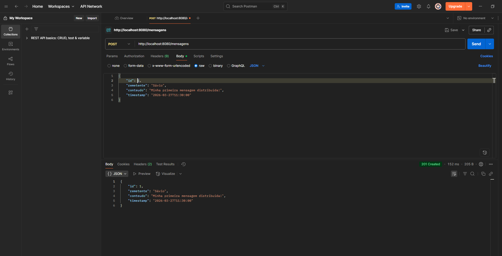
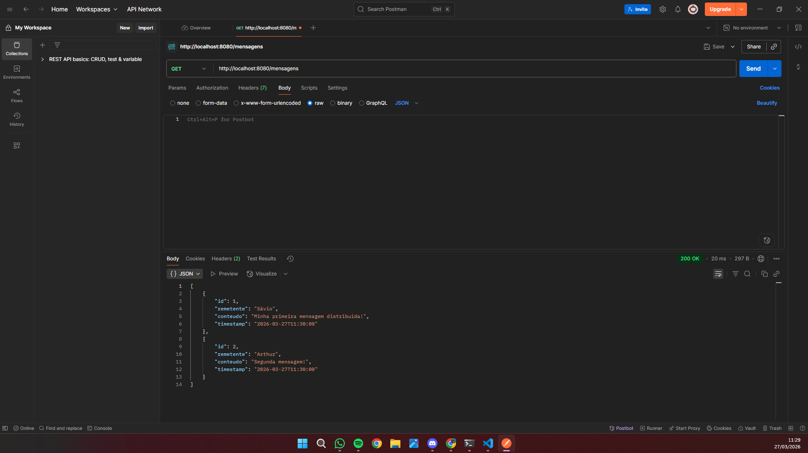
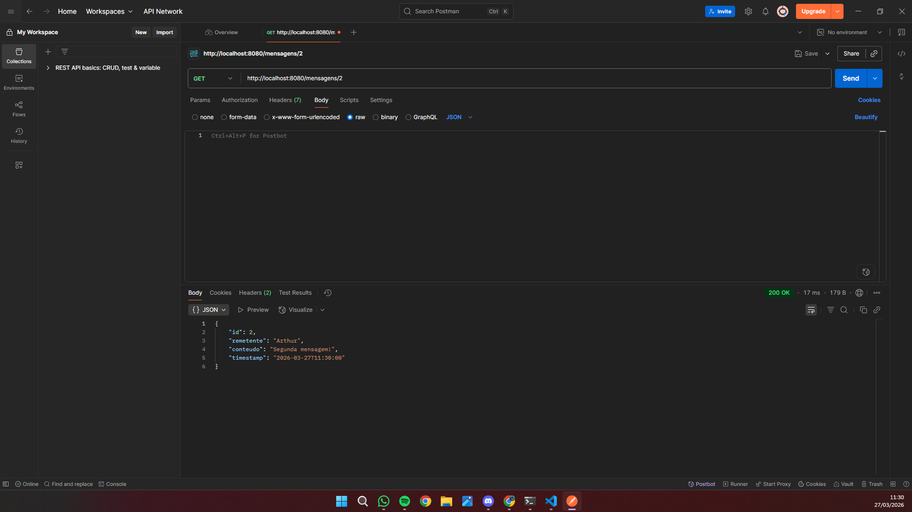
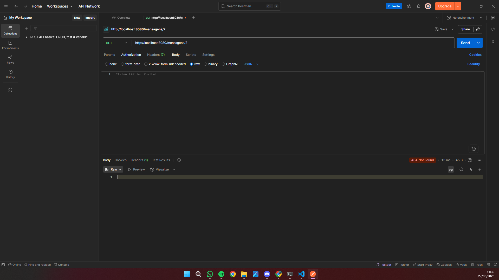
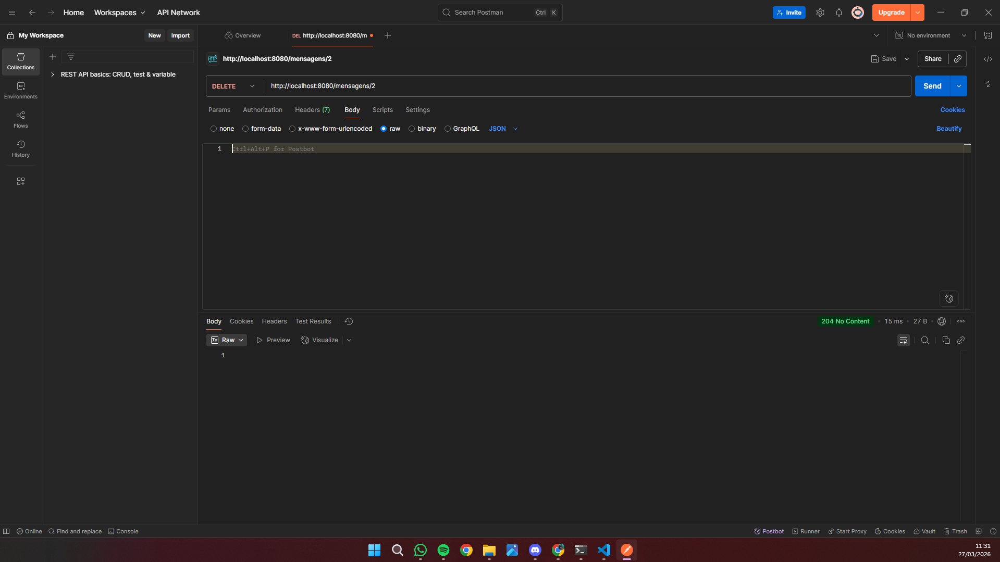

# Relatório Técnico: Sistema de Mensagens Distribuído com Quarkus

Este documento detalha a implementação e o teste de uma aplicação distribuída simples desenvolvida com o framework Quarkus. O objetivo principal é demonstrar a comunicação direta entre processos utilizando o protocolo HTTP.

## 1. Arquitetura da Solução

O sistema foi desenhado com base no modelo de comunicação *send/receive* entre processos distintos:

* **Sender (Remetente):** O cliente HTTP, representado nesta prática pela ferramenta Postman. Ele é o responsável por iniciar a comunicação, encapsulando os dados em formato JSON e enviando-os através de uma requisição TCP/HTTP.
* **Receiver (Receptor):** A aplicação Quarkus operando localmente na porta 8080. Sua função é escutar as requisições, interpretar o protocolo HTTP, desserializar o corpo da mensagem (JSON) para um objeto da linguagem Java e persistir a informação em memória.

### Fluxo de Comunicação (POST)
1. O Sender constrói um pacote HTTP contendo o cabeçalho `Content-Type: application/json` e o corpo da mensagem.
2. O protocolo HTTP atua como a camada de transporte que encapsula e entrega esse conteúdo.
3. O Receiver (Quarkus) utiliza a biblioteca Jackson para mapear o conteúdo JSON recebido diretamente para a classe de domínio `Mensagem`.

## 2. Mapeamento Teórico: Operações Send e Receive

A especificação REST e os métodos HTTP foram mapeados para os conceitos teóricos de sistemas distribuídos da seguinte forma:

* **Operação de Send (POST):** Representa o envio de um novo estado ou instrução do Sender para o Receiver. O cliente encapsula a mensagem e o servidor a processa e armazena.
* **Operação de Receive (GET):** Representa a solicitação de leitura do estado atual mantido pelo Receiver. O cliente pede a sincronização dos dados armazenados (uma ou todas as mensagens).
* **Operação de Gerenciamento (DELETE):** Representa uma instrução enviada pelo Sender para modificar o estado do Receiver, solicitando a exclusão de um recurso específico por meio de seu identificador.

## 3. Estrutura da Aplicação

### 3.1. Modelo de Dados
A entidade principal transitada entre os processos é definida pela classe `Mensagem`, contendo os seguintes atributos:
* `id` (Identificador único)
* `remetente` (Autor da mensagem)
* `conteudo` (Corpo de texto)
* `timestamp` (Data e hora do registro)

### 3.2. Endpoints e Armazenamento
Os endpoints foram implementados utilizando a especificação JAX-RS. O armazenamento foi configurado em uma estrutura de lista em memória (`List<Mensagem>`), atendendo ao escopo de persistência temporária exigido.

## 4. Evidências de Teste e Validação

Para comprovar o funcionamento da aplicação e a correta comunicação entre os processos, testes manuais foram executados via Postman. Abaixo está documentado o comportamento esperado e a evidência de cada operação:

### Criação de Mensagem
* **Método:** POST
* **Rota:** `/mensagens`
* **Status Code Retornado:** `201 Created`
* **Justificativa:** Confirma que o Receiver recebeu os dados através da requisição e criou o recurso com sucesso.



---

### Listagem de Todas as Mensagens
* **Método:** GET
* **Rota:** `/mensagens`
* **Status Code Retornado:** `200 OK`
* **Justificativa:** Retorna o estado completo da lista contendo os recursos (mensagens) criados anteriormente no sistema.



---

### Busca de Mensagem Específica por ID
* **Método:** GET
* **Rota:** `/mensagens/{id}`
* **Status Code Retornado:** `200 OK`
* **Justificativa:** Valida o processo de leitura e filtragem ao buscar por um identificador específico existente no sistema.



---

### Busca de Mensagem Inexistente (Tratamento de Erro)
* **Método:** GET
* **Rota:** `/mensagens/{id}`
* **Status Code Retornado:** `404 Not Found`
* **Justificativa:** Comprova o tratamento de erro da aplicação quando o Sender requisita a leitura de um recurso que não existe.



---

### Remoção de Mensagem
* **Método:** DELETE
* **Rota:** `/mensagens/{id}`
* **Status Code Retornado:** `204 No Content`
* **Justificativa:** Confirma que a instrução de exclusão foi acatada pelo Receiver e o recurso foi removido da memória.



## 5. Instruções de Execução

Para iniciar o Receiver localmente, certifique-se de possuir o JDK configurado corretamente e execute o comando abaixo na raiz do projeto:

```bash
./mvnw quarkus:dev